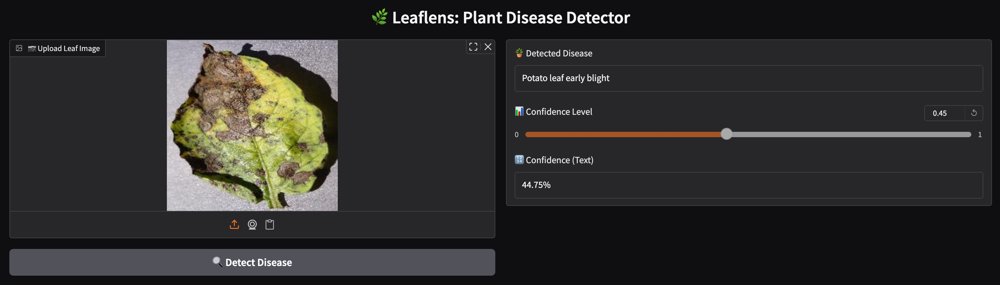

### 🌿 **What’s the Project About?**

The **LeafLens** is an AI-based project that uses **deep learning** to identify **plant leaf diseases** from images.

## 🧠 Model Architecture

This project uses **MobileNetV2** as the core model for plant disease classification.

- ✅ Pre-trained on **ImageNet**
- 🔁 Fine-tuned on the **PlantDoc dataset**
- 💡 Chosen for its lightweight structure and high efficiency on mobile and browser-based applications
- ⚙️ Custom classification layers added on top (Dense + Dropout + Softmax)

> MobileNetV2 was selected due to its excellent trade-off between accuracy and performance, making it ideal for real-time inference in interactive web apps like this one.

### 🔍 **What Does It Do (Functionality)?**

1. **📸 Takes an image of a plant leaf**  
   – You upload or pass a photo of a plant leaf (could be healthy or diseased).

2. **🧠 Detects the type of disease (if any)**  
   – The trained model analyzes the image and predicts which disease the plant might have, or says it's healthy.

3. **🔍 Classifies among multiple diseases**  
   – The model is trained on **many different classes**, like:  
   - Tomato\_\_\_Early\_blight  
   - Apple\_\_\_Black\_rot  
   - Potato\_\_\_Late\_blight  
   - And more...

4. **📊 Shows prediction result and confidence**  
   – After analysis, it returns:  
   - The **name of the disease**  
   - The **confidence/probability** (e.g., 94% Tomato\_\_\_Early\_blight)

### 💡 Real-World Use

This kind of project can help:

- **Farmers** detect plant issues early using mobile apps  
- **Agricultural experts** monitor crop health at scale  
- **Researchers** build smart farming solutions

## 📓 Try it on Colab

You can run the complete project, including training and testing, using this Colab notebook:

👉 [Open LeafLens on Colab](https://colab.research.google.com/drive/1QMBhr7lSGS7av_qnAmYQxYW1OE02yBfA?usp=sharing)


# 🌿 Gradio-Based Project

A lightweight deep learning web app built with Gradio and MobileNetV2 to detect plant leaf diseases using images.

## 🧠 Model
- Architecture: MobileNetV2 (pretrained on ImageNet)
- Fine-tuned on: [PlantDoc Dataset](https://github.com/pratikkayal/PlantDoc-Dataset)
- Format: HDF5 (`.h5`) or native Keras (`.keras`)

## 📁 Dataset
- PlantDoc: 2,598 images of diseased and healthy leaves
- Classes: Tomato_Early_blight, Apple_Black_rot, Potato_Late_blight, and more

## 🚀 Deployment
This app is deployed on Hugging Face Spaces using:
- Gradio UI
- `app.py` as the main entry point
- `requirements.txt` to install packages

## 🖼 Demo


## 🔧 Setup Locally
```bash
git clone https://github.com/your-username/smart-plant-disease-detector
cd smart-plant-disease-detector
pip install -r requirements.txt
python app.py

